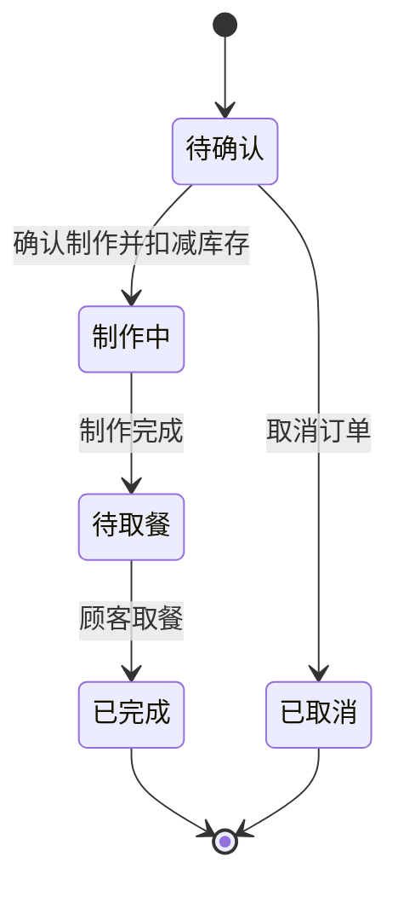

# 基于 Spring Boot 和 Vue 的小吃店管理系统 PRD

## 1. 文档信息

| 项目 | 内容 |
| --- | --- |
| 项目名称 | 基于 Spring Boot 和 Vue 的小吃店管理系统设计与实现 |
| 系统简称 | 小吃店管理系统 / SnackAdmin |
| 文档类型 | 产品需求文档（PRD） |
| 文档版本 | V1.0 |
| 目标用户 | 小吃店管理员、店长 |
| 系统形态 | 单店后台管理 Web 系统 |
| 编写目的 | 作为系统设计、数据库设计、前后端开发、测试及毕业论文编写的统一依据 |

## 2. 项目概述

### 2.1 项目背景

小型餐饮门店通常使用纸质单据或简单电子表格管理菜品、订单、原料和采购信息，容易出现数据分散、库存不准确、历史订单难以查询、经营情况缺少统计依据等问题。

本系统面向单个小吃店，围绕菜品、订单、原料库存、供应商采购和经营分析建立统一的后台管理平台。系统不接入真实支付，不开发顾客点餐端，由店长在后台录入和处理订单。

### 2.2 产品目标

1. 对菜品分类、菜品信息和菜品配方进行统一管理。
2. 支持堂食、打包订单的创建、制作和完成流程。
3. 根据菜品配方自动扣减原料库存，形成可追溯的库存流水。
4. 通过采购入库补充库存，并记录供应商及采购历史。
5. 对订单、销售额、菜品销量和采购成本进行可视化统计。
6. 通过角色权限和操作日志保障后台数据安全。

### 2.3 项目范围

本期包含以下 7 个业务模块：

1. 首页数据看板
2. 菜品分类管理
3. 菜品管理
4. 订单管理
5. 原料库存管理
6. 采购与供应商管理
7. 经营统计分析

登录、注册申请、账号审核、个人中心、角色权限和操作日志属于系统基础能力，不计入上述业务模块数量。

### 2.4 不在本期范围

- 不开发顾客点餐端、小程序或移动 App。
- 不接入微信、支付宝、银行卡等真实支付渠道。
- 不处理配送平台、骑手和配送轨迹。
- 不实现多门店、多租户和连锁店数据隔离。
- 不实现会员、优惠券、积分、营销活动和复杂财务核算。
- 不实现硬件设备对接，例如打印机、扫码枪和电子秤。

## 3. 用户角色与权限

### 3.1 角色定义

| 角色 | 角色说明 |
| --- | --- |
| 管理员 | 系统最高权限用户，负责店长账号审核、账号状态管理、系统数据维护，并拥有全部业务权限 |
| 店长 | 日常经营用户，负责菜品、订单、库存、采购、供应商及统计数据的管理，无账号审核和系统级配置权限 |

本系统不设置店员角色。毕业设计场景下，管理员和店长两级权限已能够体现 RBAC 权限控制；新增店员会增加权限矩阵和测试成本，但不会显著增加核心业务价值。如后期需要扩展，可在现有 RBAC 模型中新增店员角色。

### 3.2 权限矩阵

| 功能 | 管理员 | 店长 |
| --- | :---: | :---: |
| 登录、退出、修改个人资料 | 是 | 是 |
| 审核注册申请 | 是 | 否 |
| 启用、禁用、重置店长账号 | 是 | 否 |
| 查看操作日志 | 是 | 否 |
| 查看数据看板 | 是 | 是 |
| 菜品分类管理 | 是 | 是 |
| 菜品及配方管理 | 是 | 是 |
| 订单创建及状态处理 | 是 | 是 |
| 原料库存管理 | 是 | 是 |
| 供应商及采购管理 | 是 | 是 |
| 经营统计和数据导出 | 是 | 是 |

### 3.3 注册与账号审核规则

1. 系统初始化时预置一个管理员账号，管理员不通过公开页面注册。
2. 注册页面仅供店长提交账号申请，字段包括用户名、姓名、手机号、密码和确认密码。
3. 新注册账号状态为“待审核”，审核通过前不能登录系统。
4. 管理员可以通过或驳回申请；驳回时必须填写原因。
5. 管理员可以禁用已启用账号，禁用后该账号的现有登录令牌立即失效。
6. 用户名和手机号必须唯一，密码必须加密存储，不得保存明文。

账号状态定义：

```text
待审核 PENDING -> 已启用 ENABLED
待审核 PENDING -> 已驳回 REJECTED
已启用 ENABLED <-> 已禁用 DISABLED
```

## 4. 总体业务设计

### 4.1 核心业务闭环


### 4.2 订单状态流转



订单规则：

1. 新订单保存后状态为“待确认”。
2. 待确认订单允许修改菜品数量、备注和订单类型。
3. 订单进入“制作中”时，系统按菜品配方一次性扣减原料库存。
4. 任一原料库存不足时，不允许订单进入“制作中”，并提示缺少的原料和数量。
5. 待确认订单可以取消，取消时不产生库存变化。
6. 制作中及之后的订单不允许直接取消，避免已消耗原料被错误恢复；异常订单由管理员通过库存调整处理，并在备注中说明。
7. 已完成和已取消订单不可修改或删除。
8. 只有已完成订单计入营业额、订单完成量和菜品销量统计。

### 4.3 采购状态流转

```text
草稿 DRAFT -> 已入库 WAREHOUSED
草稿 DRAFT -> 已作废 CANCELLED
```

采购规则：

1. 草稿状态允许修改采购明细或作废。
2. 确认入库后，采购单和采购明细不可修改。
3. 入库操作必须在同一事务内更新采购状态、增加原料库存并生成库存流水。
4. 已入库采购单不得删除，录入错误时通过库存调整修正并保留记录。

## 5. 功能需求

### 5.1 系统基础能力

#### 5.1.1 登录与退出

| 编号 | 功能 | 需求说明 |
| --- | --- | --- |
| AUTH-001 | 用户登录 | 使用用户名和密码登录，校验账号状态及密码 |
| AUTH-002 | 登录限制 | 待审核、已驳回、已禁用账号不得登录，并返回明确提示 |
| AUTH-003 | 登录凭证 | 登录成功后签发访问令牌，前端请求自动携带令牌 |
| AUTH-004 | 获取用户信息 | 返回用户资料、角色和权限标识，用于生成菜单和按钮权限 |
| AUTH-005 | 安全退出 | 清除前端令牌，并使当前令牌失效 |
| AUTH-006 | 登录保护 | 连续多次密码错误时进行验证码或短时锁定，防止暴力尝试 |

#### 5.1.2 注册申请与账号管理

| 编号 | 功能 | 需求说明 |
| --- | --- | --- |
| USER-001 | 注册申请 | 店长填写信息并提交，系统校验用户名、手机号唯一性 |
| USER-002 | 申请审核 | 管理员查看申请详情并执行通过或驳回 |
| USER-003 | 账号查询 | 按用户名、姓名、手机号和状态组合查询 |
| USER-004 | 账号状态 | 管理员启用或禁用店长账号 |
| USER-005 | 重置密码 | 管理员将密码重置为临时密码，用户登录后自行修改 |
| USER-006 | 个人中心 | 用户查看和修改姓名、手机号、头像及登录密码 |

#### 5.1.3 通用后台能力

- 列表页面支持分页、条件查询、重置和刷新。
- 新增、修改、删除、作废、入库等关键操作需要二次确认。
- 表单统一显示必填项、字段长度、格式及业务校验提示。
- 所有业务数据采用逻辑删除；历史订单、采购单和库存流水禁止删除。
- 记录登录、审核、增删改、订单状态变更、采购入库和库存调整操作日志。

### 5.2 模块一：首页数据看板

#### 5.2.1 功能目标

帮助管理员和店长快速掌握当天经营状态、近期趋势和待处理事项。

#### 5.2.2 页面内容

| 编号 | 功能区域 | 需求说明 |
| --- | --- | --- |
| DASH-001 | 今日概览 | 展示今日完成订单数、今日营业额、待确认订单数、制作中订单数 |
| DASH-002 | 基础数据 | 展示上架菜品数、原料种类数、低库存原料数、启用供应商数 |
| DASH-003 | 订单趋势 | 折线图展示最近 7 天完成订单数和营业额 |
| DASH-004 | 热销排行 | 展示最近 7 天销量前 5 的菜品 |
| DASH-005 | 库存预警 | 展示库存低于或等于安全库存的原料，支持跳转库存页面 |
| DASH-006 | 待办事项 | 展示待审核账号、待确认订单和低库存原料数量 |

#### 5.2.3 统计口径

- 今日以服务器所在时区 `Asia/Shanghai` 的自然日计算。
- 营业额为已完成订单的订单金额合计。
- 热销菜品按已完成订单明细中的销售数量降序排列。
- 低库存条件为“当前库存小于或等于安全库存”。

### 5.3 模块二：菜品分类管理

#### 5.3.1 数据字段

| 字段 | 必填 | 说明 |
| --- | :---: | --- |
| 分类名称 | 是 | 2 至 20 个字符，同名分类不可重复 |
| 排序值 | 是 | 非负整数，数值越小越靠前 |
| 状态 | 是 | 启用或停用 |
| 备注 | 否 | 最多 200 个字符 |

#### 5.3.2 功能需求

| 编号 | 功能 | 需求说明 |
| --- | --- | --- |
| CAT-001 | 分类列表 | 按名称和状态查询，显示菜品数量、排序和更新时间 |
| CAT-002 | 新增分类 | 校验分类名称唯一性 |
| CAT-003 | 修改分类 | 支持修改名称、排序、状态和备注 |
| CAT-004 | 停用分类 | 分类停用后，该分类下菜品不得新上架 |
| CAT-005 | 删除分类 | 分类下不存在菜品时才允许逻辑删除 |
| CAT-006 | 分类排序 | 按排序值和创建时间稳定排序 |

### 5.4 模块三：菜品管理

#### 5.4.1 菜品数据字段

| 字段 | 必填 | 说明 |
| --- | :---: | --- |
| 菜品名称 | 是 | 2 至 50 个字符，同一分类下名称不可重复 |
| 菜品分类 | 是 | 只能选择未删除分类 |
| 菜品图片 | 否 | 支持 JPG、PNG、WebP，单张不超过 5 MB |
| 基础价格 | 是 | 大于等于 0，保留两位小数 |
| 口味 | 否 | 例如清淡、微辣、中辣，最多 50 个字符 |
| 菜品描述 | 否 | 最多 500 个字符 |
| 推荐状态 | 是 | 普通或推荐 |
| 销售状态 | 是 | 草稿、已上架、已下架 |

#### 5.4.2 菜品规格

菜品可以没有规格，也可以配置多个规格。配置规格时，每个规格包含规格名称和销售价格，例如“小份 8 元”“大份 12 元”。订单选择有规格的菜品时必须选择一个规格。

#### 5.4.3 菜品配方

菜品配方用于关联原料和单份用量，例如“鸡蛋面”关联面条 200 克、鸡蛋 1 个、青菜 50 克。

配方规则：

1. 每个准备上架的菜品至少配置一项原料。
2. 同一菜品配方中，同一种原料只能出现一次。
3. 单份用量必须大于 0，计量单位继承原料单位。
4. 菜品上架后仍可修改配方，但修改仅影响后续开始制作的订单。
5. 已下架菜品仍可用于历史订单展示，但不能加入新订单。

#### 5.4.4 功能需求

| 编号 | 功能 | 需求说明 |
| --- | --- | --- |
| DISH-001 | 菜品列表 | 按名称、分类、销售状态、推荐状态组合查询 |
| DISH-002 | 新增菜品 | 保存基础信息、规格和配方，可先保存为草稿 |
| DISH-003 | 修改菜品 | 修改基础信息、规格和配方 |
| DISH-004 | 上架菜品 | 校验分类启用、价格有效、配方完整、关联原料未删除 |
| DISH-005 | 下架菜品 | 下架后不可加入新订单，不影响历史订单 |
| DISH-006 | 删除菜品 | 仅草稿或已下架菜品允许逻辑删除；存在订单记录时保留历史快照 |
| DISH-007 | 推荐设置 | 支持设置和取消推荐菜品 |
| DISH-008 | 图片上传 | 上传成功后返回可访问地址，替换图片时清理无引用旧文件 |

### 5.5 模块四：订单管理

#### 5.5.1 订单数据字段

| 字段 | 必填 | 说明 |
| --- | :---: | --- |
| 订单编号 | 系统生成 | 格式建议为 `ODyyyyMMddHHmmss + 4位随机数`，全局唯一 |
| 订单类型 | 是 | 堂食或打包 |
| 桌号 | 条件必填 | 堂食时必填，打包时隐藏 |
| 取餐号 | 系统生成 | 当日递增展示号，可重复跨日使用 |
| 菜品明细 | 是 | 至少包含一个已上架菜品 |
| 订单金额 | 系统计算 | 各明细成交单价乘数量后求和 |
| 顾客备注 | 否 | 最多 200 个字符，例如少辣、不要香菜 |
| 内部备注 | 否 | 最多 200 个字符，仅后台可见 |
| 订单状态 | 系统维护 | 待确认、制作中、待取餐、已完成、已取消 |
| 创建人 | 系统记录 | 当前登录用户 |

#### 5.5.2 订单明细快照

订单明细必须保存下单时的菜品名称、分类名称、规格名称、成交单价和数量。后续修改菜品名称、价格或规格时，历史订单展示内容不发生变化。

#### 5.5.3 功能需求

| 编号 | 功能 | 需求说明 |
| --- | --- | --- |
| ORDER-001 | 创建订单 | 选择订单类型、菜品、规格和数量，实时计算金额 |
| ORDER-002 | 编辑订单 | 仅待确认订单允许修改，保存后重新计算金额 |
| ORDER-003 | 订单列表 | 按订单号、取餐号、类型、状态、创建人和时间范围查询 |
| ORDER-004 | 订单详情 | 展示订单信息、明细快照、状态时间线和操作记录 |
| ORDER-005 | 开始制作 | 校验库存后扣减原料，并将状态改为制作中 |
| ORDER-006 | 制作完成 | 将制作中订单改为待取餐 |
| ORDER-007 | 完成订单 | 将待取餐订单改为已完成，并计入经营统计 |
| ORDER-008 | 取消订单 | 仅待确认订单允许取消，必须填写取消原因 |
| ORDER-009 | 导出订单 | 按当前查询条件导出 Excel，导出内容不包含敏感账号信息 |

#### 5.5.4 库存扣减示例

订单包含 2 份鸡蛋面，每份使用面条 200 克、鸡蛋 1 个，则开始制作时生成两条库存出库记录：

```text
面条：-400 克
鸡蛋：-2 个
```

库存校验、库存扣减、库存流水生成和订单状态修改必须在一个数据库事务内完成，任一操作失败时全部回滚。

### 5.6 模块五：原料库存管理

#### 5.6.1 原料数据字段

| 字段 | 必填 | 说明 |
| --- | :---: | --- |
| 原料名称 | 是 | 2 至 50 个字符，不允许重复 |
| 原料分类 | 是 | 主食、蔬菜、肉类、调料、包装材料、其他 |
| 计量单位 | 是 | 克、千克、毫升、升、个、份、包等 |
| 当前库存 | 系统维护 | 不允许直接修改，不得小于 0 |
| 安全库存 | 是 | 大于等于 0，用于库存预警 |
| 状态 | 是 | 启用或停用 |
| 备注 | 否 | 最多 200 个字符 |

#### 5.6.2 库存变动类型

| 类型 | 库存方向 | 来源 |
| --- | --- | --- |
| 采购入库 | 增加 | 采购单入库 |
| 订单消耗 | 减少 | 订单开始制作 |
| 盘盈调整 | 增加 | 人工库存调整 |
| 盘亏调整 | 减少 | 人工库存调整 |

#### 5.6.3 功能需求

| 编号 | 功能 | 需求说明 |
| --- | --- | --- |
| MAT-001 | 原料列表 | 按名称、分类、状态和是否预警查询 |
| MAT-002 | 新增原料 | 原料初始库存固定为 0，通过采购或调整产生库存 |
| MAT-003 | 修改原料 | 修改分类、安全库存、状态和备注；单位被业务引用后不可修改 |
| MAT-004 | 停用原料 | 被上架菜品配方引用时不允许停用 |
| MAT-005 | 删除原料 | 无配方、采购、订单消耗和库存流水引用时才允许逻辑删除 |
| MAT-006 | 库存调整 | 填写盘盈或盘亏数量及原因，盘亏后库存不得小于 0 |
| MAT-007 | 库存流水 | 按原料、变动类型、时间和业务单号查询 |
| MAT-008 | 库存预警 | 当前库存小于或等于安全库存时标记预警 |

库存流水必须记录变动前库存、变动数量、变动后库存、业务类型、业务单号、操作人、时间和备注。

### 5.7 模块六：采购与供应商管理

#### 5.7.1 供应商数据字段

| 字段 | 必填 | 说明 |
| --- | :---: | --- |
| 供应商名称 | 是 | 2 至 100 个字符，不允许重复 |
| 联系人 | 是 | 最多 30 个字符 |
| 联系电话 | 是 | 校验手机号或常用电话格式 |
| 联系地址 | 否 | 最多 200 个字符 |
| 供应原料 | 否 | 文本说明或标签 |
| 状态 | 是 | 启用或停用 |
| 备注 | 否 | 最多 200 个字符 |

#### 5.7.2 采购单数据字段

| 字段 | 必填 | 说明 |
| --- | :---: | --- |
| 采购单号 | 系统生成 | 格式建议为 `POyyyyMMddHHmmss + 4位随机数` |
| 供应商 | 是 | 只能选择启用的供应商 |
| 采购日期 | 是 | 默认当前日期，可修改 |
| 采购明细 | 是 | 至少一项原料 |
| 采购总额 | 系统计算 | 各明细采购单价乘采购数量后求和 |
| 状态 | 系统维护 | 草稿、已入库、已作废 |
| 备注 | 否 | 最多 200 个字符 |

#### 5.7.3 功能需求

| 编号 | 功能 | 需求说明 |
| --- | --- | --- |
| SUP-001 | 供应商列表 | 按名称、联系人、电话和状态查询 |
| SUP-002 | 供应商维护 | 新增、修改、启用和停用供应商 |
| SUP-003 | 删除供应商 | 不存在采购单引用时才允许逻辑删除 |
| PUR-001 | 创建采购单 | 选择供应商、原料、数量和采购单价，自动计算总额 |
| PUR-002 | 修改采购单 | 仅草稿状态允许修改采购信息和明细 |
| PUR-003 | 采购入库 | 增加原料库存、生成库存流水并锁定采购单 |
| PUR-004 | 作废采购单 | 仅草稿状态允许作废，必须填写作废原因 |
| PUR-005 | 采购查询 | 按采购单号、供应商、状态和日期范围查询 |
| PUR-006 | 采购详情 | 展示采购明细、状态和操作记录 |

### 5.8 模块七：经营统计分析

#### 5.8.1 功能需求

| 编号 | 统计项目 | 展示形式 | 统计口径 |
| --- | --- | --- | --- |
| STAT-001 | 营业额趋势 | 折线图 | 已完成订单金额，支持日、周、月维度 |
| STAT-002 | 订单量趋势 | 折线图 | 各时间段创建量、完成量和取消量 |
| STAT-003 | 菜品销量排行 | 横向柱状图 | 已完成订单明细数量，默认前 10 |
| STAT-004 | 分类销量占比 | 饼图 | 已完成订单按菜品分类汇总销量 |
| STAT-005 | 订单类型占比 | 饼图 | 堂食和打包订单数量占比 |
| STAT-006 | 订单完成率 | 指标卡 | 完成订单数除以非待处理订单数 |
| STAT-007 | 采购成本趋势 | 柱状图 | 已入库采购单总额，支持日、月维度 |
| STAT-008 | 原料消耗排行 | 柱状图 | 订单消耗库存流水按原料汇总 |
| STAT-009 | 数据导出 | Excel | 按当前日期范围导出统计明细 |

#### 5.8.2 查询规则

- 默认查询最近 30 天，支持自定义日期范围。
- 单次日期范围最长 366 天，避免大范围统计影响性能。
- 图表必须同时提供明确的标题、单位、图例和无数据状态。
- 金额统一保留两位小数，数量按原料计量精度展示。

## 6. 页面与导航设计

### 6.1 页面结构

后台采用左侧导航、顶部工具栏和右侧内容区的布局。顶部显示折叠菜单、面包屑、当前用户、角色和退出入口。

### 6.2 路由清单

| 一级菜单 | 页面/路由建议 | 访问角色 |
| --- | --- | --- |
| 登录注册 | `/login`、`/register` | 未登录用户 |
| 首页 | `/dashboard` | 管理员、店长 |
| 菜品管理 | `/dish/category`、`/dish/list` | 管理员、店长 |
| 订单管理 | `/order/list`、`/order/create`、`/order/:id` | 管理员、店长 |
| 库存管理 | `/inventory/material`、`/inventory/record` | 管理员、店长 |
| 采购管理 | `/purchase/supplier`、`/purchase/list`、`/purchase/:id` | 管理员、店长 |
| 经营统计 | `/statistics/business` | 管理员、店长 |
| 系统管理 | `/system/user`、`/system/audit`、`/system/log` | 管理员 |
| 个人中心 | `/profile` | 管理员、店长 |

### 6.3 通用交互要求

- 列表首屏包含页面标题、查询区、操作区、数据表格和分页器。
- 新增、编辑优先使用对话框或抽屉；订单创建使用独立页面。
- 保存按钮提交期间显示加载状态并防止重复提交。
- 删除、取消、作废、入库、状态变更必须弹出确认提示。
- 请求成功显示简短结果提示，请求失败显示可理解的错误原因。
- 表格无数据时显示空状态，不使用空白页面。
- 订单状态、库存预警和账号状态使用统一颜色标签。
- 页面在 1366×768 及以上桌面分辨率正常使用，最小支持 1024 像素宽度；本期不要求移动端适配。

## 7. 数据设计

### 7.1 核心数据表

| 表名 | 用途 | 关键字段 |
| --- | --- | --- |
| `sys_user` | 用户账号 | username、password、real_name、phone、status |
| `sys_role` | 角色信息 | role_code、role_name |
| `sys_user_role` | 用户角色关联 | user_id、role_id |
| `sys_operation_log` | 操作日志 | module、operation、method、operator_id、result、created_at |
| `dish_category` | 菜品分类 | name、sort、status |
| `dish` | 菜品信息 | category_id、name、base_price、image_url、sale_status |
| `dish_spec` | 菜品规格 | dish_id、name、price |
| `material` | 原料及库存 | name、category、unit、current_stock、safe_stock、status |
| `dish_material` | 菜品配方 | dish_id、material_id、quantity |
| `orders` | 订单主表 | order_no、order_type、status、total_amount、created_by |
| `order_item` | 订单明细快照 | order_id、dish_id、dish_name、spec_name、unit_price、quantity |
| `order_status_log` | 订单状态历史 | order_id、before_status、after_status、operator_id |
| `supplier` | 供应商 | name、contact_name、contact_phone、status |
| `purchase_order` | 采购单 | purchase_no、supplier_id、status、total_amount |
| `purchase_order_item` | 采购明细 | purchase_order_id、material_id、quantity、unit_price |
| `inventory_record` | 库存流水 | material_id、change_type、before_stock、change_quantity、after_stock |

### 7.2 通用字段约定

除纯关联表外，主要业务表建议包含：

```text
id              bigint       主键
created_by      bigint       创建人
created_at      datetime     创建时间
updated_by      bigint       更新人
updated_at      datetime     更新时间
deleted         tinyint      逻辑删除标识，0 未删除、1 已删除
version         int          乐观锁版本号（库存等并发数据使用）
```

### 7.3 数据精度与约束

- 金额字段使用 `decimal(10,2)`，禁止使用浮点类型。
- 原料数量使用 `decimal(12,3)`，满足克、千克、毫升等计量需求。
- 业务状态在代码中使用枚举，在数据库中保存稳定的英文编码。
- 用户名、手机号、订单号、采购单号建立唯一索引。
- 常用查询字段如订单状态、创建时间、菜品分类、原料预警建立普通索引。
- 外键关系由应用层和数据库约束共同保证，逻辑删除前检查业务引用。

## 8. 接口设计约定

### 8.1 技术约定

- 接口风格采用 RESTful API，统一前缀为 `/api`。
- 请求和响应使用 UTF-8 编码的 JSON。
- 文件上传使用 `multipart/form-data`。
- 时间使用 `yyyy-MM-dd HH:mm:ss`，日期使用 `yyyy-MM-dd`。
- 分页参数统一为 `pageNum`、`pageSize`，页码从 1 开始。

### 8.2 统一响应结构

```json
{
  "code": 200,
  "message": "操作成功",
  "data": {},
  "timestamp": "2026-07-15 12:00:00"
}
```

分页数据结构：

```json
{
  "list": [],
  "total": 0,
  "pageNum": 1,
  "pageSize": 10
}
```

### 8.3 主要接口清单

| 模块 | 方法与路径示例 | 用途 |
| --- | --- | --- |
| 认证 | `POST /api/auth/login` | 登录 |
| 认证 | `POST /api/auth/register` | 提交店长注册申请 |
| 用户 | `PUT /api/users/{id}/audit` | 审核账号 |
| 看板 | `GET /api/dashboard/summary` | 获取首页概览 |
| 分类 | `GET/POST /api/dish-categories` | 查询、新增分类 |
| 菜品 | `GET/POST /api/dishes` | 查询、新增菜品 |
| 菜品 | `PUT /api/dishes/{id}/sale-status` | 上下架菜品 |
| 订单 | `GET/POST /api/orders` | 查询、创建订单 |
| 订单 | `PUT /api/orders/{id}/status` | 流转订单状态 |
| 原料 | `GET/POST /api/materials` | 查询、新增原料 |
| 库存 | `POST /api/inventory/adjustments` | 库存调整 |
| 库存 | `GET /api/inventory/records` | 查询库存流水 |
| 供应商 | `GET/POST /api/suppliers` | 查询、新增供应商 |
| 采购 | `GET/POST /api/purchase-orders` | 查询、新增采购单 |
| 采购 | `POST /api/purchase-orders/{id}/warehouse` | 采购入库 |
| 统计 | `GET /api/statistics/business` | 获取经营统计 |

### 8.4 错误码建议

| 错误码 | 场景 |
| --- | --- |
| 400 | 参数格式或业务校验失败 |
| 401 | 未登录、令牌失效 |
| 403 | 无角色或操作权限 |
| 404 | 业务数据不存在 |
| 409 | 唯一性冲突、状态冲突或库存不足 |
| 500 | 服务端未知异常 |

业务异常应返回明确描述，例如“鸡蛋库存不足：需要 6 个，当前库存 4 个”，不得只返回“操作失败”。

## 9. 非功能需求

### 9.1 性能要求

- 普通列表和详情接口在正常数据量下响应时间不超过 1 秒。
- 统计接口在一年范围内响应时间不超过 3 秒。
- 列表默认每页 10 条，支持 10、20、50、100 条，不允许一次返回全部大数据。
- 首页统计可使用 Redis 缓存，订单、采购或库存变化后主动失效相关缓存。

### 9.2 安全要求

- 使用 Spring Security 和 JWT 完成身份认证与接口授权。
- 密码使用 BCrypt 加密，不在日志或响应中返回密码。
- 前端路由权限只用于改善体验，后端接口必须再次校验权限。
- 对文件类型、文件大小和文件名进行校验，防止上传可执行文件。
- 对用户输入进行参数校验，ORM 使用参数绑定避免 SQL 注入。
- 关键操作记录操作人、时间、IP、模块、结果和异常摘要。

### 9.3 可靠性要求

- 订单扣库存和采购入库使用数据库事务。
- 库存更新使用乐观锁或带库存条件的原子更新，避免并发超扣。
- 后端统一异常处理，禁止将堆栈信息直接返回前端。
- 数据库建议每日备份，毕业设计演示前准备可恢复的初始化数据脚本。

### 9.4 可维护性要求

- 后端按控制层、业务层、数据访问层分层，业务规则不得堆积在 Controller。
- 前端按业务模块组织 API、页面和组件，通用表格及状态组件可复用。
- 使用 OpenAPI 生成接口文档，接口字段和枚举必须有中文说明。
- 核心业务方法编写单元测试，核心流程编写接口集成测试。

## 10. 推荐技术方案

### 10.1 前端

- Vue 3
- Vite
- Element Plus
- Vue Router
- Pinia
- Axios
- ECharts

### 10.2 后端

- Java 21
- Spring Boot 3.x
- Spring Security
- JWT
- MyBatis-Plus
- MySQL 8.x
- Redis（可选，用于缓存和令牌失效控制）
- SpringDoc OpenAPI
- EasyExcel（订单和统计导出）

### 10.3 部署

- Nginx 部署前端静态文件并反向代理后端接口。
- Spring Boot 打包为 JAR 运行。
- MySQL 保存业务数据。
- 菜品图片开发阶段保存在本地目录，部署时通过 Nginx 提供静态访问。
- 可使用 Docker Compose 统一启动 Nginx、后端、MySQL 和 Redis。

## 11. 验收标准

### 11.1 基础能力验收

- 店长可以提交注册申请，未审核账号不能登录。
- 管理员可以通过、驳回、禁用和启用店长账号。
- 管理员与店长登录后看到符合权限的菜单和按钮。
- 店长不能访问账号审核和操作日志接口。

### 11.2 业务功能验收

- 可以完成分类、菜品、规格和配方的新增、修改、查询及状态管理。
- 不完整配方或停用分类下的菜品不能上架。
- 可以创建堂食和打包订单，金额计算准确，历史订单保留菜品快照。
- 库存充足时订单可以进入制作中，并准确扣减配方原料。
- 库存不足时订单状态和库存均不变化，并显示具体缺料信息。
- 采购单入库后库存增加、采购状态更新、库存流水生成三者保持一致。
- 库存调整有原因、有操作人且调整后库存不小于 0。
- 数据看板和经营统计只按定义的状态及时间口径统计。
- 订单、采购和库存流水可以按条件查询，导出数据与查询结果一致。

### 11.3 质量验收

- 核心页面无阻断操作的前端错误和明显布局错乱。
- 所有接口返回结构统一，常见异常有明确中文提示。
- 密码未明文存储，未登录或越权请求被正确拦截。
- 订单扣库存、采购入库等事务场景通过集成测试。
- 系统提供数据库建表脚本、初始化数据和部署运行说明。

## 12. 开发优先级与迭代计划

### 12.1 第一阶段：基础框架

- 搭建前后端工程和数据库。
- 实现统一响应、异常处理、参数校验和代码规范。
- 实现登录、注册审核、JWT 认证、角色权限和动态菜单。

### 12.2 第二阶段：菜品与库存基础

- 实现菜品分类、原料、菜品规格和菜品配方。
- 实现菜品图片上传、草稿、上架和下架。
- 实现库存调整和库存流水。

### 12.3 第三阶段：订单核心流程

- 实现订单创建、明细快照和状态机。
- 实现按配方校验和扣减库存。
- 完成事务、并发库存和异常场景测试。

### 12.4 第四阶段：采购闭环

- 实现供应商管理、采购单和采购入库。
- 采购入库与库存流水联动。

### 12.5 第五阶段：统计与完善

- 实现数据看板、经营统计和 Excel 导出。
- 补充操作日志、缓存、测试数据、接口文档和部署脚本。
- 完成毕业设计演示数据和论文所需系统截图。

## 13. 核心测试场景

| 编号 | 测试场景 | 预期结果 |
| --- | --- | --- |
| TC-001 | 待审核店长登录 | 拒绝登录并提示账号待审核 |
| TC-002 | 店长访问账号审核接口 | 返回 403，无权访问 |
| TC-003 | 上架未配置配方的菜品 | 上架失败并提示需配置配方 |
| TC-004 | 创建包含已下架菜品的订单 | 保存失败并提示菜品不可售 |
| TC-005 | 库存充足时开始制作 | 订单变为制作中，库存准确扣减并生成流水 |
| TC-006 | 库存不足时开始制作 | 操作失败，订单状态和所有原料库存均不变化 |
| TC-007 | 重复点击开始制作 | 仅第一次成功，不重复扣减库存 |
| TC-008 | 采购单确认入库 | 采购单锁定，库存增加并生成对应流水 |
| TC-009 | 重复入库同一采购单 | 第二次操作失败，库存不重复增加 |
| TC-010 | 盘亏数量大于当前库存 | 调整失败，库存不得为负数 |
| TC-011 | 菜品修改价格后查看历史订单 | 历史订单仍显示下单时价格 |
| TC-012 | 完成订单后查看统计 | 营业额、订单量和菜品销量按规则增加 |

## 14. 后续可选扩展

以下功能不纳入 V1.0 验收，可在毕业设计时间充足时选择一至两项扩展：

- 新增店员角色，并限制其仅处理订单和查看部分库存。
- 增加菜品月度销量预测或原料采购建议。
- 增加库存预警消息和首页通知中心。
- 增加操作日志详情和数据变更对比。
- 增加打印订单小票功能，但不连接真实打印机。
- 增加系统参数配置，例如店铺名称、营业时间和订单编号规则。

## 15. 产品决策记录

| 决策 | 结论 | 原因 |
| --- | --- | --- |
| 是否开发顾客端 | 否 | 项目聚焦后台经营管理，控制毕业设计规模 |
| 是否接入支付 | 否 | 模拟支付业务价值低，真实支付接入成本和合规要求较高 |
| 是否设置店员角色 | V1.0 不设置 | 两角色已能体现权限设计，店长可覆盖全部日常操作 |
| 是否支持多门店 | 否 | 单店场景足以形成完整业务闭环，避免引入租户隔离复杂度 |
| 何时扣减库存 | 订单进入制作中时 | 比创建订单时更符合实际消耗时点，也避免待确认订单占用库存 |
| 已制作订单能否取消 | 不允许直接取消 | 原料可能已经消耗，自动恢复库存会造成账实不符 |
| 注册账号默认角色 | 店长 | 管理员由系统初始化，避免公开注册获得最高权限 |

